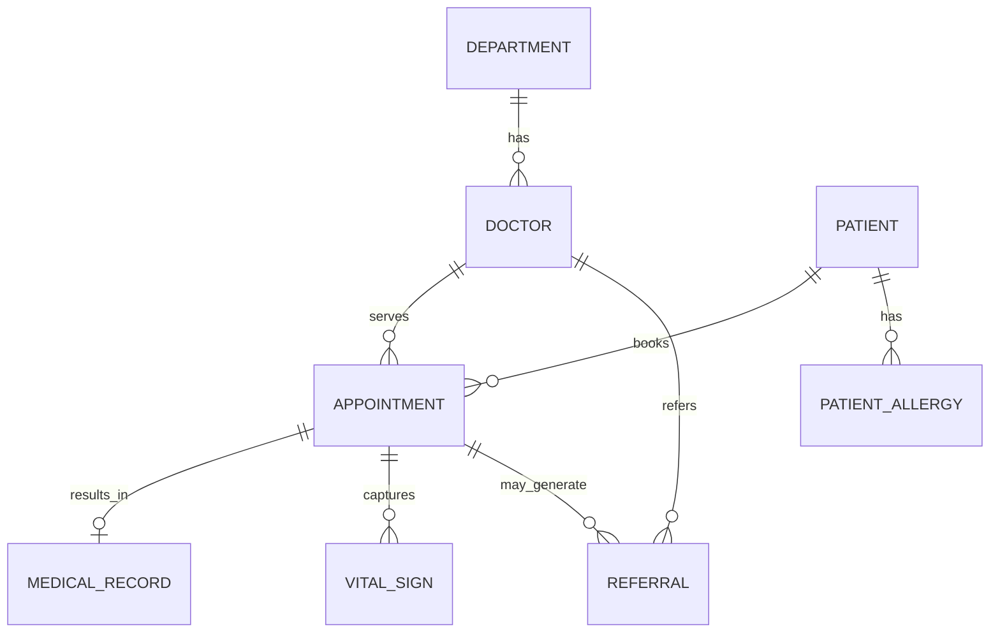
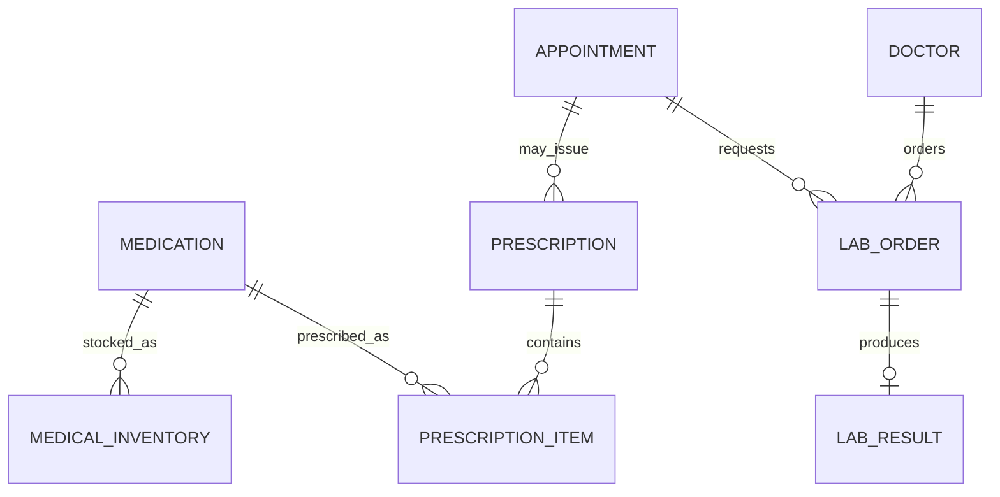
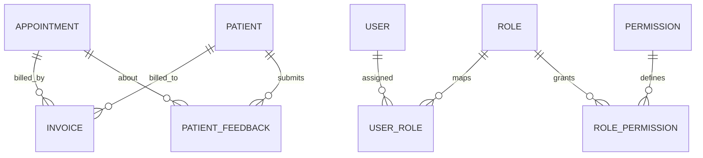

# Conceptual Level Diagrams

This document provides conceptual-level views (business entities and relationships), independent from implementation details.

## 1. Core Clinical Conceptual Model

## 2. Pharmacy and Lab Conceptual Model

## 3. Finance, Feedback, and Security Conceptual Model

## 4. Conceptual Notes

- A patient can have many appointments over time.
- An appointment can produce one medical record and multiple vitals/lab/prescription artifacts.
- Inventory and prescriptions are linked through medication entities.
- Billing and feedback are conceptually attached to care events (appointments) and patients.
- Access control follows role-permission mapping with user-role assignments.
