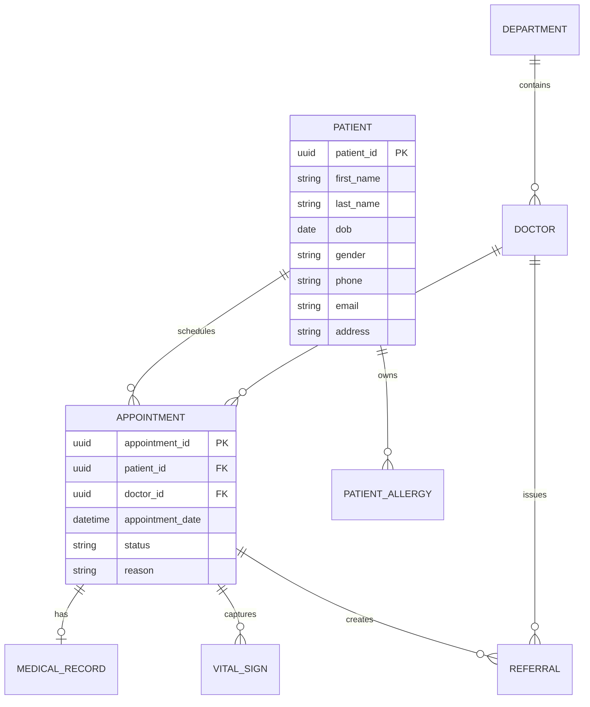
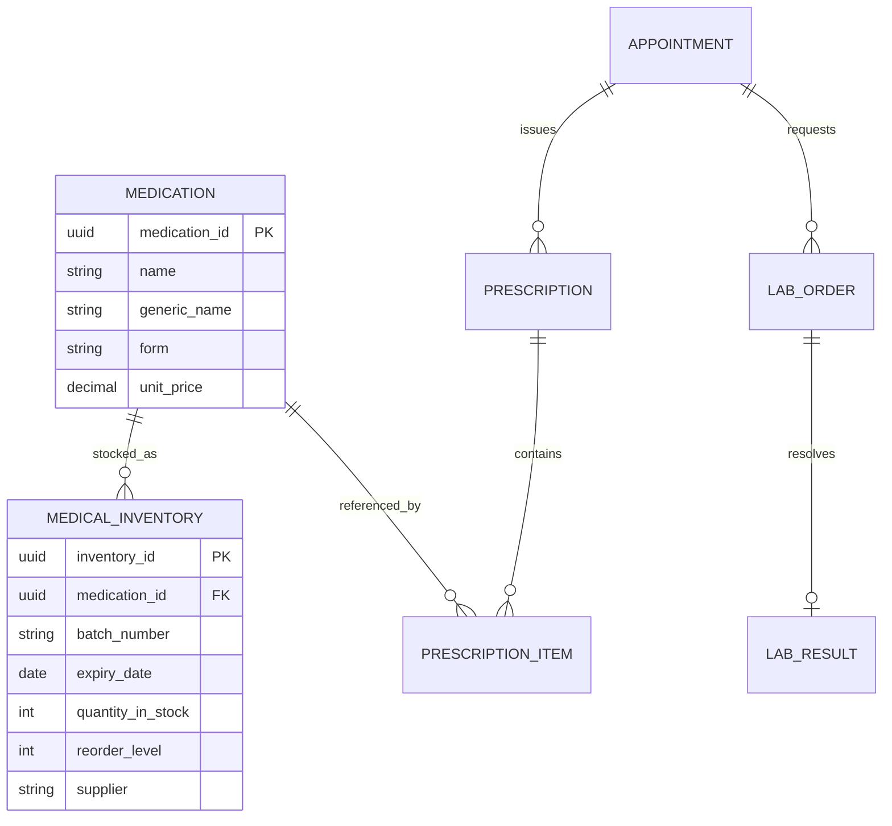
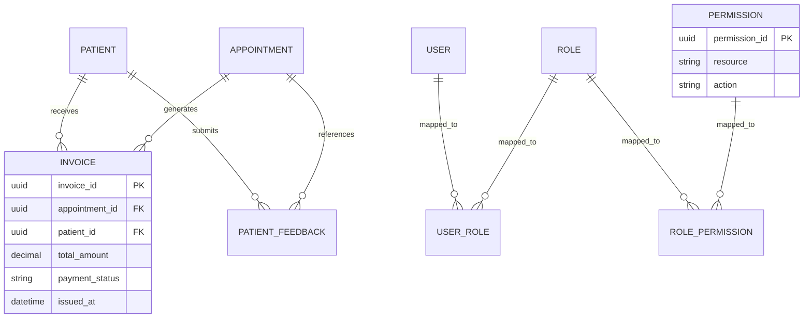

# Logical Level Diagrams

This document describes the logical data model for the Hospital Management System, including entities, key attributes, and normalized relationships.

## 1. Clinical and Patient Care Logical Model

## 2. Pharmacy and Lab Logical Model

## 3. Billing, Feedback, and Access Control Logical Model

## 4. Logical Design Notes

- The logical model follows 3NF-oriented separation of concerns.
- Many-to-many role assignment and permission assignment are resolved through bridge tables.
- Medical and operational workflows are linked through appointment_id for traceability.
- UUID keys are used across the model for consistency and distributed-safe identifiers.
