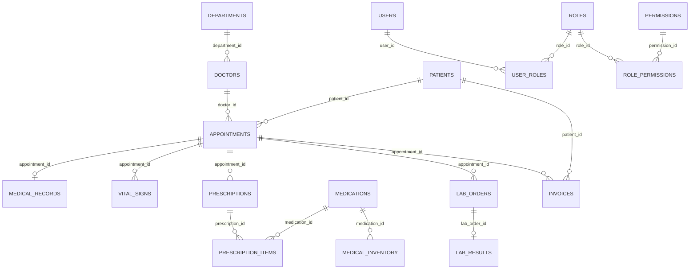

# Physical Level Diagrams

This document describes the physical schema view (PostgreSQL implementation), including UUID primary keys, foreign keys, and implementation-oriented structures.

## 1. Physical ER Diagram (Core Tables)



## 2. Physical Key Patterns

- Primary keys are UUID with default generation via `gen_random_uuid()`.
- Foreign keys use UUID and reference parent UUID keys.
- Junction tables (`user_roles`, `role_permissions`) implement many-to-many joins.
- Soft delete behavior is implemented with nullable `deleted_at` in selected tables.
- Audit and system logging tables are append-oriented for traceability.

## 3. Physical SQL Pattern Examples

```sql
-- UUID-enabled extension
CREATE EXTENSION IF NOT EXISTS pgcrypto;

-- Typical parent table
CREATE TABLE patients (
  patient_id UUID PRIMARY KEY DEFAULT gen_random_uuid(),
  first_name TEXT NOT NULL,
  last_name TEXT NOT NULL,
  created_at TIMESTAMP NOT NULL DEFAULT now()
);

-- Typical child table
CREATE TABLE appointments (
  appointment_id UUID PRIMARY KEY DEFAULT gen_random_uuid(),
  patient_id UUID NOT NULL REFERENCES patients(patient_id),
  doctor_id UUID NOT NULL REFERENCES doctors(doctor_id),
  appointment_date TIMESTAMP NOT NULL,
  status TEXT NOT NULL,
  created_at TIMESTAMP NOT NULL DEFAULT now()
);
```

## 4. Physical Performance and Integrity Notes

- Keep indexes on high-frequency lookup FKs (`patient_id`, `doctor_id`, `appointment_id`).
- Keep compound indexes for common filters (status plus date, active plus created_at).
- Enforce check constraints for status and enum-like columns where needed.
- Maintain trigger-based `updated_at` behavior on mutable tables.

## 5. Source Files

- Root ERD SQL: `hmserd-postgresql.sql`
- Runtime schema scripts: `src/main/resources/hospital/management/sql/`
- Database reference: `DATABASE.md`
